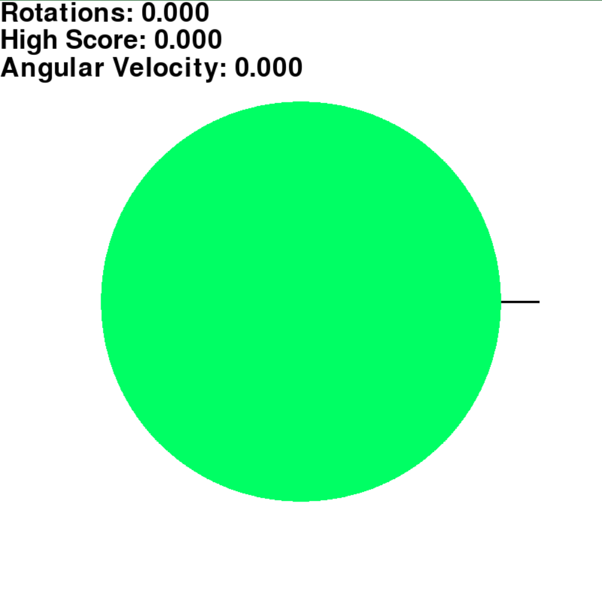

# Wheel Spinner
A basic wheel spinner made in pygame

# Requirements
pygame

# Usage
When you have the requirements installed, download wheelspinner.py and run with
```bash
python wheelspinner.py
```

# Controls
Click, drag and let go of the mouse to spin the wheel

# Screenshot
